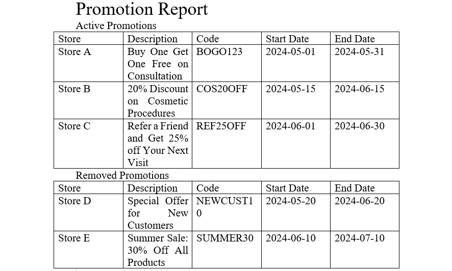
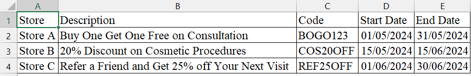
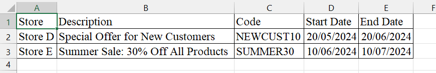

# Практична робота No3
# ВИКОРИСТАННЯ СОМ-ТЕХНОЛОГІЇ.ЕКСПОРТ ДАНИХ У ДОКУМЕНТИ WORD ТА EXCEL

# Мета

Вивчення та практичне відпрацювання механізмів використання компонентів на основі СОМ -технології та її застосування в .NET. Вивчення особливостей використання додатків та програмного формування документів MS Office.

# Завдання

Розробити два незалежні plug-in модулі (dll - assembly) для основної програми, які формуватимуть звіти у форматах MS Word і MS Excel з використанням COM-технології [1, 2] для взаємодії з відповідними програмами Microsoft Office. У цій роботі поняття plug-in має на увазі пізнє зв'язування та динамічне завантаження модулів під час роботи основної програми, а не під час компіляції.

# Варіанти завдання

Як основний додаток рекомендується використовувати програму, яка розробляється в рамках курсового проекту з ООП. Для формування звіту використовувати не менше двох списків у контексті теми курсового проекту
(наприклад, список користувачів та список товарів). Звіт повинен формуватися та зберігатися у вигляді файлу відповідного формату. Кожен із списків бажано оформити у вигляді окремої таблиці у документі MS Word та на окремих аркушах у MS Excel.

# Порядок виконання роботи

1. Для роботи з об'єктом COM необхідно вказати посилання на відповідний компонент Microsoft.Office.Interop.Excel та/або Microsoft.Office.Interop.Word . Якщо в системі інстальовано кілька версій MS Office , то кожна версія буде представлена своїм компонентом Microsoft.Office.Interop.* .

2. У тексті програми підключити збірки в такий спосіб (для Excel , для Word – аналогічно):

using Excel = Microsoft.Office.Interop.Excel;

using Word = Microsoft.Office.Interop.Word;

3. У тексті програми додати створення відповідних об'єктів для Excel (додаток,
книга, лист):

Excel.Application xlApp = new Excel.ApplicationClass();

Excel.Workbook xlBook = xlApp.Workbooks.Add

(XlWBATemplate.xlWBATWorksheet);

Excel . Worksheet xlSheet = (Excel.Worksheet) xlBook.Worksheets.get _Item (1);

або для Word (додаток, документ, параграф):
Word.Application wdApp = new Word.Application ();
Word.Document doc = wdApp.Documents.Add();
Word.Paragraph p = doc.Paragraphs.Add();

4. Завершити роботу з кожним COM -об'єктом у програмі за допомогою
методу:

System.Runtime.InteropServices.Marshal.ReleaseComObject(obj);

після цього примусово одноразово звернутися до «збирача сміття» (Garbage Collector):

GC.Collect();

GC.WaitForPendingFinalizers();

і перевірити за допомогою диспетчера завдань, що програма (COM- сервер Excel або Word ) в операційній системі теж завершили свою роботу.

# Результат виконання роботи

Результат створеного Word файлу:

Результат створеного Excel файлу:

# ВИСНОВОК

Під час виконання практичної роботи було вивченно та практично відпрацюванно механізми використання компонентів на основі СОМ -технології та її застосування в .NET. Вивченно особливостей використання додатків та програмного формування документів MS Office. Було  створено два класи Library - Class_Word та Class_Excel, які формують звіти у форматах MS Word та MS Excel з використанням COM-технологіхї для взіємодії з відповідними програмами Microsoft Office.

Таблиця 3.1
| №  | Складність       | Вимоги до роботи                                                                                                 | Бали | Що виконанно |
|----|------------------|------------------------------------------------------------------------------------------------------------------|------|--------------|
| 1  | Базовий рівень   | Експорт текстових даних у документ MS Word та коректне завершення роботи COM-об'єкта                             | 2    |       +      |
| 2  | Базовий рівень   | Експорт текстових даних до таблиці MS Excel та коректне завершення роботи COM-об'єкта                            | 2    |       +      |
| 3  | Базовий рівень   | Реалізація завдань експорту (п.1 і п.2) як окремих збірок (dll assembly), що динамічно завантажуються            | 1    |       +      |
| 4  | Підвищений рівень| Додатково до п.1 програмне формування таблиць для даних MS Word, що експортуються                                | 2    |       +      |
| 5  | Підвищений рівень| Пізніше зв'язування. Налаштування активного модуля експорту користувачем під час роботи програмного забезпечення | 1    |       +      |
